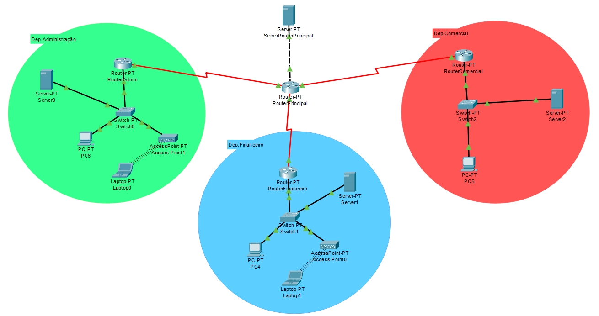

# Infraestrutura de Rede com RIP e DHCP (Packet Tracer)

> ⚠️ *Nota:* Este foi um dos meus **primeiros projetos de redes** e uma das primeiras experiências com o **Cisco Packet Tracer**. Embora não esteja perfeito, foi um exercício valioso de aprendizagem prática.

Este projeto consiste na simulação de uma rede com três departamentos interligados, utilizando os protocolos **RIP** para encaminhamento dinâmico e **DHCP** para atribuição automática de IPs. Foi desenvolvido com o **Cisco Packet Tracer** como parte de um trabalho prático na unidade curricular de **Comunicação de Dados**, do curso de Redes e Segurança Informática.

---

## 🎯 Objetivos do Projeto

- Planeamento e implementação de uma rede para uma organização simulada
- Criação de três sub-redes distintas (Administração, Financeiro e Comercial)
- Configuração de um router central e routers locais para cada departamento
- Implementação do protocolo **RIP**
- Configuração de **servidores DHCP** em cada departamento
- Testes de conectividade entre departamentos

---

## 🧩 Topologia da Rede

A rede é composta por:

- 1 Router principal  
- 3 Routers de departamento (Administração, Financeiro, Comercial)  
- 3 Servidores (um por departamento)  
- PCs, Laptops, Switches e Access Points  

### Visualização da Topologia

---

## 🗺️ Plano de Endereçamento

Cada sub-rede possui um bloco de endereços distinto. Os IPs utilizados nos routers funcionam como gateways entre os segmentos de rede. O protocolo RIP foi configurado para partilhar rotas entre os routers de forma dinâmica e automática.

---

## 🔁 Protocolo RIP

Todos os routers foram configurados com o protocolo **RIP v2** para permitir que as rotas entre os departamentos sejam distribuídas dinamicamente, evitando a necessidade de rotas estáticas.

---

## 📦 DHCP

Cada servidor por departamento atua como servidor **DHCP**, atribuindo automaticamente IPs aos dispositivos da respetiva LAN (como PCs, laptops e access points).

---

## 🧪 Testes Realizados

- Ping entre dispositivos de diferentes departamentos  
- Testes com `ipconfig`, `ping` e `DHCP Request`  
- Verificação da distribuição automática de IPs e da propagação das rotas RIP

---

## ⚠️ Limitações

- A parte do DNS e da configuração de um servidor web não foi concluída devido a dificuldades técnicas, mas o projeto já cumpre os requisitos essenciais de conectividade.

---

## 🛠️ Tecnologias e Ferramentas

- Cisco Packet Tracer  
- RIP (Routing Information Protocol)  
- DHCP (Dynamic Host Configuration Protocol)  
- IPv4  
- Equipamentos simulados Cisco (routers, switches, PCs, APs, etc.)

---

## 👥 Autor  
- Simão Paiva 

Braga, junho de 2024

---

## 📁 Ficheiros

- `rede.pkt`: Ficheiro do Cisco Packet Tracer com toda a configuração  
- `topologia.png`: Imagem com a topologia da rede
